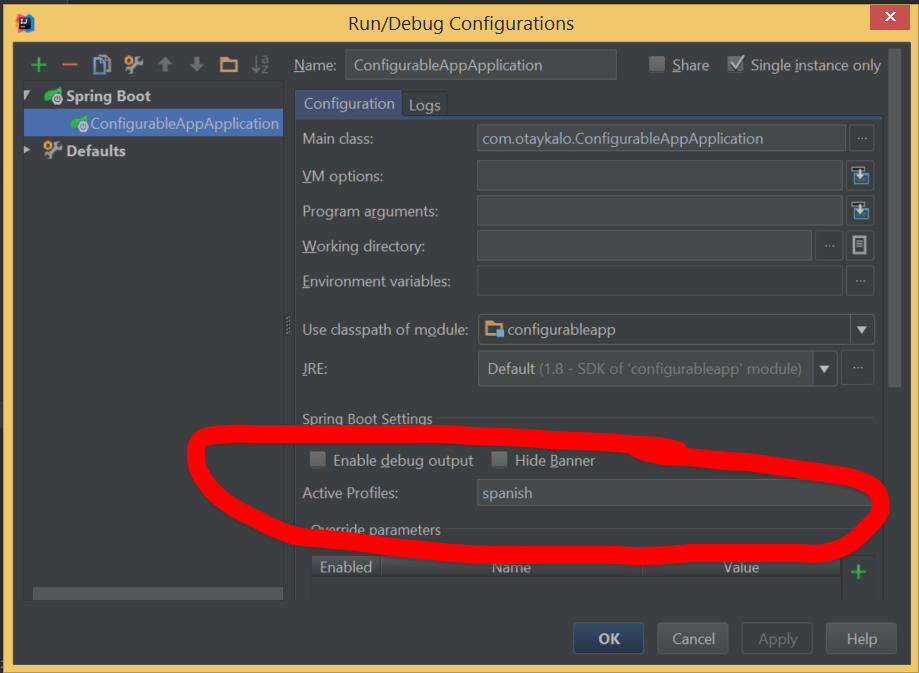

Example of simple configurable Spring boot project

This project contains

* Swagger endpoint documentation
* sprint actuator with nice endpoints
* configurable variables that reads properties from application.yml

When you run this app, go to localhost:9090,

Some nice endpoints :

[Swagger](http://localhost:9090/http://localhost:9090/swagger-ui.html)

and actuator's endpoints, working from the scratch

```
 "self": {
      "href": "http://localhost:9090/actuator"
    },
    "dump": {
      "href": "http://localhost:9090/dump"
    },
    "autoconfig": {
      "href": "http://localhost:9090/autoconfig"
    },
    "health": {
      "href": "http://localhost:9090/health"
    },
    "metrics": {
      "href": "http://localhost:9090/metrics"
    },
    "info": {
      "href": "http://localhost:9090/info"
    },
    "configprops": {
      "href": "http://localhost:9090/configprops"
    },
    "beans": {
      "href": "http://localhost:9090/beans"
    },
    "trace": {
      "href": "http://localhost:9090/trace"
    },
    "env": {
      "href": "http://localhost:9090/env"
    },
    "mappings": {
      "href": "http://localhost:9090/mappings"
    }
```

if you visit [http://localhost:9090/env](http://localhost:9090/env), you'll see value of our configuration property for greeing. which is very handy for debug.

And all these nice actuator endpoints are accessible by just simple pom reference

```xml
  <dependency>
            <groupId>org.springframework.boot</groupId>
            <artifactId>spring-boot-actuator</artifactId>
  </dependency>
```

Just for sake of documentation, this is the order of search for configuration variables in Spring

1. Command Line Arguments
1. JNDI
1. Java system properties
1. OS Env variables
1. Properites files
1. @PropertySource
1. Defaults

So if you want to do some debugging, you can just override it with command line parameter.

Or ENV variable SPRING_PROFILES_ACTIVE.

Or using IDEA configuration.


Using different profiles, you can use them to differentiate dev, test, acceptance and prod environments.
